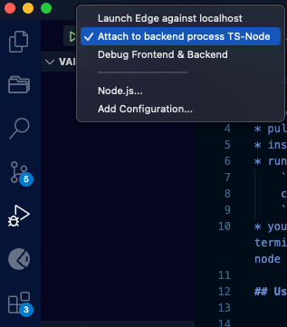
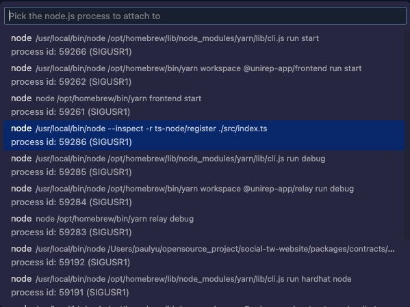
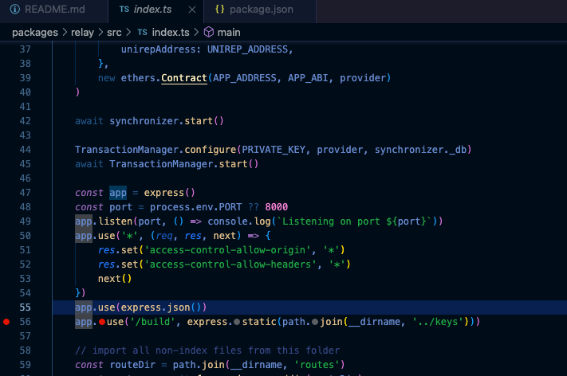

# Local Development

# Troubleshooting Tips
* pull latest changes from master and `yarn install` and `yarn build`
* install circom if you haven't already
* run following command and set up Twitter API Key. By default, it's a invalid API key.
    ```shell
    cp packages/relay/.env_example packages/relay/.env
    ```
* you may start all daemons in one terminal window with `yarn start`, or start each daemon in a separate terminal window. If you start separately, it's easier to debug, since you don't need to restart hardhat node and redeploy contracts every time you change the code.

## Use VSCode Debugger to Debug Relay
With this configuration `.vscode/launch.json` in place, you can use VSCode debugger to debug relay.
```json
"version": "0.2.0",
    "configurations": [
        {
            "type": "node",
            "request": "attach",
            "name": "Attach to backend process TS-Node",
            "processId": "${command:PickProcess}",
            "skipFiles": [
                "<node_internals>/**"
            ]
        },
    ],
```


Select debug configuration

attach to process

and set breakpoint.

# Testing
In the root directory, run:
```shell
yarn run test
```
or run tests for a specific package:
```shell
yarn run test --scope @unirep-app/relay
```
